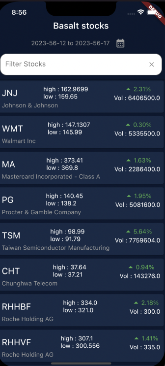

   
   
  <h1>BASALT flutter assesment stocks app</h1>
  <strong>A Flutter app that displays stock market data and allows users to track their favorite stocks.</strong>
   

Built by <a href="https://www.linkedin.com/in/mitchell-herbst/">Mitchell Herbst</a>
 

# Features

- Displays stock data for major stock exchanges using the marketstack.com api
- That is about it, but it can be something much larger :)

## UI

  <table>
    <tr>
      <td style="text-align: center">
        
      </td>
    </tr>
  </table>

## Packages

- [connectivity_plus: Used to check the internet connectivity of the application](https://pub.dev/packages/connectivity_plus)
- [flutter_bloc: The most popular(And for a good reason) state management library for Flutter ](https://pub.dev/packages/flutter_bloc)
- [go_router: A powerful and simple routing library for Flutter](https://pub.dev/packages/go_router)
# Installing
 - [This is where we insert a very long description on how to install and run Flutter applications, find it on Flutter website](https://flutter.dev/)
 - [Please provide your own marketstack.com api key in lib/constants.dart to interact with the marketstack api](https://www.marketstack.com)

